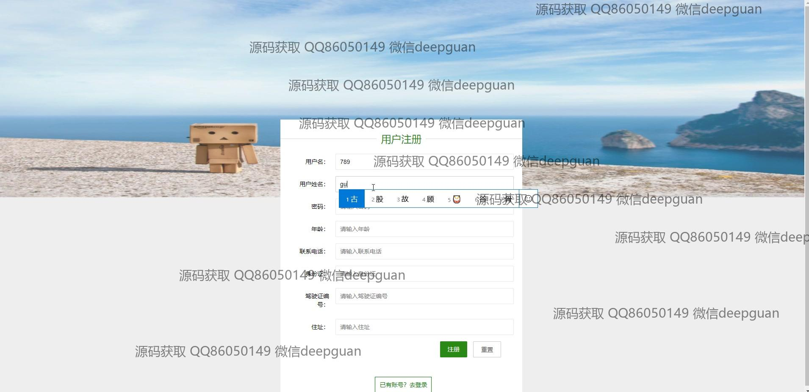
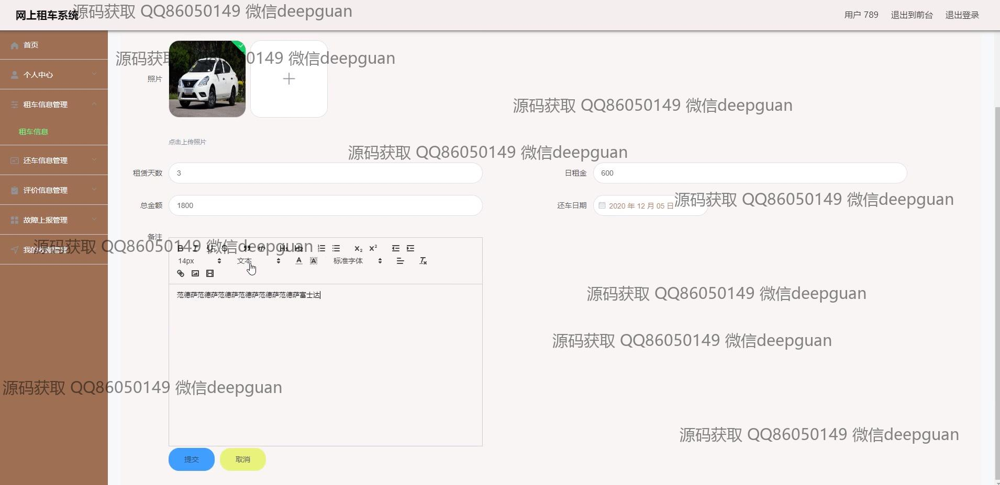

<h1 align="center">汽车租赁故障上报网上租车vue</h1>

## 简介
汽车租赁管理系统：角色分为管理员、用户；支持故障上报、租车信息管理、车辆信息管理、用户管理、评价管理等功能，界面设计简洁直观，提升用户体验。    --计算机毕业设计源码；毕设源码；java毕业设计源码

## 联系方式

<h3 align="center">获取完整代码与数据库文件 + 微信：deepguan QQ: 86050149 QQ群: 783742310</h3>

<h3 align="center">可帮忙远程部署 包运行成功！提供远程部署、修改代码、设计文档指导、代码讲解等服务！</h3>

## 功能介绍（完整见运行截图）
管理员：基本功能包括登录、注册、退出系统，管理网站首页轮播图和新闻资讯。主要管理模块包括车辆信息管理（增删改查车辆信息及上传图片）、用户信息管理、租车和还车信息管理（订单查看、编辑、删除）、评价管理、故障上报管理（处理用户提交的故障及回复），以及系统设置和个人中心功能。

用户：支持登录、注册、退出系统，浏览网站首页并查看车辆信息列表。可通过租车模块选择车辆，填写租车信息如租赁天数、租金、取车地址等，完成订单提交。用户还可以管理还车信息、评价订单、查看并提交车辆故障报告，以及管理个人信息、我的收藏和历史订单记录。

## 运行截图

本代码来源于网络,仅供学习参考使用!

